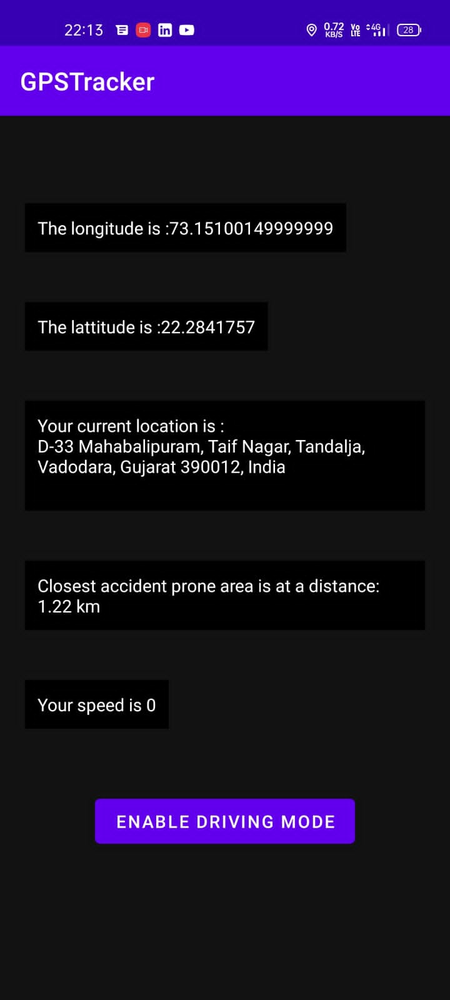

# DEV.HNZ-ROAD_PROBLEMS

<br>

## our two solutions on real life problems

```
1.] GPS Tracker for alerting driver in accident prone zone
2.] Accident Detection
```

### GPS tracker for accident prone zone :

```
Our mobile app will help drivers to make them
aware and alert whenever they enter an accident
prone zone.

The app will run even in background even when
destroyed or closed using foreground services.

```

<p align="center">

</p>
Features of this app :

```
1.] Whenever the driver enter an accident prone zone an alert will be sent in the form of a voice

2.] The alert will be given in regular intervals until he/she does not exit the accident prone zone.

3.] If the speed is more than 30 km/h then there will be another alert in the form of voice to reduce speed.

4.] There is driving mode where the phone will be locked if the driver has entered accident prone zone

5.] The driving mode can be enabled or disabled as per the wish of the driver.
```


UI of the app:-
```

1.] Latitude and longitude are provided.

2.] Current Location of the driver.

3.] Distance from the closest accident prone zone.

4.] Speed of the car which is being driven.

5.] Enable Driving Mode/ Disable Driving Mode.

```

### Tech used :

```
LocationManager library for getting latitude and longitude

GeoCoder for getting address, speed, etc

JAVA

```
